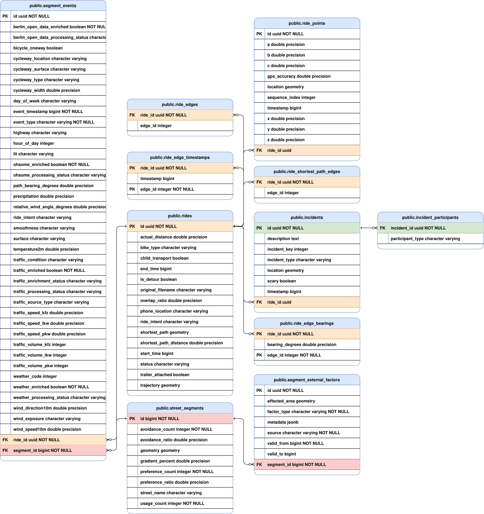

# Data Model

## Entity Relationship Overview



---

## Entities

### `rides`

The central entity. One record per imported SimRa ride file.

| Field | Type | Description |
|---|---|---|
| `id` | UUID | Primary key |
| `status` | enum | Processing lifecycle state (see below) |
| `bikeType` | enum | `CITY_TREKKING_BIKE`, `ROAD_RACING_BIKE`, `E_BIKE`, `FREIGHT_BICYCLE`, `MOUNTAIN_BIKE`, `RECUMBENT_BICYCLE`, `TANDEM_BICYCLE`, `OTHER` |
| `rideIntent` | enum | `COMMUTE`, `LEISURE`, `UNKNOWN` — set by classifier after analysis |
| `childTransport` | boolean | Rider had a child seat |
| `trailerAttached` | boolean | Trailer attached |
| `phoneLocation` | enum | `POCKET`, `HANDLEBAR`, `JACKET_POCKET`, `HAND`, `BASKET`, `BAG`, `OTHER` |
| `startTime` / `endTime` | epoch ms | Ride start and end timestamps |
| `trajectory` | LineString (4326) | Map-matched GPS trajectory |
| `shortestPath` | LineString (4326) | GraphHopper shortest path between start and end |
| `actualDistance` | double | Distance of the map-matched trajectory in meters |
| `shortestPathDistance` | double | Distance of the shortest path in meters |
| `isDetour` | boolean | True if actual > shortest × 1.10 |
| `overlapRatio` | double | Fraction of shortest-path edges also present in actual route |
| `originalFilename` | string | Source CSV filename |

**Ride status lifecycle:**

```
PENDING → ANALYZING → PROCESSED
                    → ALTERNATIVE_ROUTE
                    → SKIPPED
                    → ERROR
```

- `PENDING` — map-matched successfully, waiting for detour analysis
- `ANALYZING` — claimed by a worker thread
- `PROCESSED` — detour analysis complete
- `ALTERNATIVE_ROUTE` — took a completely different corridor (< 30% edge overlap)
- `SKIPPED` — too few points, no traversed edges, or routing failed
- `ERROR` — unhandled exception during analysis

---

### `ride_points`

Individual GPS samples from the raw SimRa recording.

| Field | Type | Description |
|---|---|---|
| `location` | Point (4326) | GPS coordinate |
| `timestamp` | epoch ms | Sample time |
| `x`, `y`, `z` | double | Accelerometer axes |
| `a`, `b`, `c` | double | Gyroscope axes |
| `gpsAccuracy` | double | GPS accuracy radius in meters |
| `sequenceIndex` | int | Tiebreaker when timestamps collide |

`ride_id` is indexed - this table holds one row per GPS sample across all rides, so every per-ride lookup (e.g. during detour analysis) relies on that index rather than a full table scan.

---

### `incidents`

Safety incidents self-reported by the rider during the ride.

| Field | Type | Description |
|---|---|---|
| `incidentType` | enum | `CLOSE_PASS`, `PULLING_IN_OUT`, `NEAR_HOOK`, `HEAD_ON`, `TAILGATING`, `NEAR_DOORING`, `DODGING`, `OTHER`, `NOTHING` |
| `location` | Point (4326) | Where the incident occurred |
| `timestamp` | epoch ms | When it occurred |
| `scary` | boolean | Rider flagged it as scary |
| `description` | text | Free text description |

Incidents also have a `incident_participants` collection table with `ParticipantType` values: `BUS`, `CYCLIST`, `PEDESTRIAN`, `DELIVERY_VAN`, `TRUCK`, `MOTORCYCLE`, `CAR`, `TAXI`, `SCOOTER`, `OTHER`.

---

### `street_segments`

One record per GraphHopper road network edge. The `id` is the GraphHopper edge ID — segments are created on demand the first time a ride traverses or avoids them.

| Field | Type | Description |
|---|---|---|
| `id` | long (GraphHopper edge ID) | Primary key |
| `streetName` | string | OSM name tag at time of graph build |
| `geometry` | LineString (4326) | Edge geometry |
| `usageCount` | int | Times a ride traversed this segment |
| `avoidanceCount` | int | Times a ride avoided this segment (it was on the shortest path but bypassed) |
| `preferenceCount` | int | Times a ride chose this segment (it was not on the shortest path) |
| `avoidanceRatio` | double | `avoidanceCount / (avoidanceCount + usageCount)` |
| `preferenceRatio` | double | `preferenceCount / usageCount`; preferred traversals are a subset of usage |
| `gradientPercent` | double | Elevation gradient derived from DEM data |

Ratios are recomputed in-place on every increment — they are always consistent with the counts.

No secondary indices beyond the primary key — lookups are by `id` (the GraphHopper edge ID) or via `segment_events`/`segment_external_factors`, which are themselves indexed on `segment_id`.

---

### `segment_events`

One record per avoidance or preference observation. This is the primary analytical table — each row connects a ride to a segment with full contextual data attached.

**Core fields:**

| Field | Type | Description |
|---|---|---|
| `id` | UUID | Primary key |
| `segmentId` | long (FK) | The `street_segments` row this event belongs to |
| `rideId` | UUID (FK) | The `rides` row this event was generated from |
| `eventType` | enum | `AVOIDANCE` or `PREFERENCE` |
| `eventTimestamp` | epoch ms | When the rider was near this edge |
| `dayOfWeek` | enum | Pre-computed from `eventTimestamp` in Berlin timezone |
| `hourOfDay` | int | Pre-computed hour (0–23) in Berlin timezone |
| `rideIntent` | enum | Copied from the ride at event creation time |
| `pathBearingDegrees` | double | Compass direction the cyclist was heading on this edge |

Note: `bikeType` appears in the REST API's event JSON (see [data-export.md](data-export.md)) but is not a `segment_events` column — it's read from the joined `Ride` at serialization time.

Indexed on `segment_id`, `eventTimestamp`, `eventType`, and `cyclewayType` — the first three back the common per-segment/time-range/type lookups; the `cyclewayType` index backs the infrastructure-signals analytics query.

**Enrichment status fields** (one pair per source):

Each source tracks its own boolean flag and processing status independently, so partial enrichment is possible and failed sources can be retried without re-processing others.

| Source | Flag field | Status field | Values |
|---|---|---|---|
| Weather | `weatherEnriched` | `weatherProcessingStatus` | `PENDING` → `DONE` / `ERROR` |
| Traffic | `trafficEnriched` | `trafficProcessingStatus` | `PENDING` → `DONE` / `ERROR` |
| OSM (Ohsome) | `ohsomeEnriched` | `ohsomeProcessingStatus` | `PENDING` → `DONE` / `ERROR` |
| Road closures | `berlinOpenDataEnriched` | `berlinOpenDataProcessingStatus` | `PENDING` → `DONE` / `ERROR` |

**Weather fields** (populated after Open-Meteo enrichment):

`temperature2m`, `precipitation`, `windSpeed10m`, `windDirection10m`, `weatherCode`, `relativeWindAngleDegrees`, `windExposure` (`HEADWIND`, `CROSSWIND`, `TAILWIND`)

**Traffic fields** (populated after Berlin traffic detector enrichment):

`trafficCondition` (`LIGHT`, `MODERATE`, `HEAVY`, `CONGESTED`), `trafficSourceType`, `trafficEnrichmentStatus`, `trafficVolumeKfz`, `trafficSpeedKfz`, `trafficVolumePkw`, `trafficSpeedPkw`, `trafficVolumeLkw`, `trafficSpeedLkw`

**OSM infrastructure fields** (populated after Ohsome enrichment):

`surface`, `smoothness`, `lit`, `highway`, `cyclewayType` (`TRACK`, `LANE`, `SHARED_LANE`, `SHARE_BUSWAY`, `SEPARATE`, `NO`), `cyclewayLocation` (`LEFT`, `RIGHT`, `BOTH`, `NONE`), `cyclewaySurface`, `cyclewayWidth`, `bicycleOneway`

---

### `segment_external_factors`

Stores segment-level external conditions (weather events, road closures, construction) with a validity time window. This is separate from `segment_events` because these factors apply to a segment over a time range rather than to a single ride observation.

| Field | Type | Description |
|---|---|---|
| `factorType` | enum | `WEATHER`, `CONSTRUCTION`, `ROAD_CLOSURE`, `TRAFFIC`, `EVENT`, `HAZARD`, `INCIDENT` |
| `source` | string | Origin identifier, e.g. `"berlin-open-data"`, `"open-meteo"` |
| `validFrom` / `validTo` | epoch ms | Time window when this factor was active |
| `affectedArea` | Geometry (4326) | Optional spatial extent (e.g. construction site polygon) |
| `metadata` | jsonb | Source-specific attributes without a fixed schema |

A unique constraint on `(segment_id, factorType, source, validFrom)` prevents duplicate factor records. Indexed on `segment_id`, `factorType`, and `(validFrom, validTo)` — the last backs the `/api/segments/{id}/factors` overlap query.

---

### `road_closures`

One normalized occurrence from either the private historical VIZ snapshots or the VIZ Berlin Baustellen/Sperrungen (construction/closures) live feed, imported by `RoadClosureImportService`. Historical snapshots are inserted once into a database; live imports retain their existing upsert behavior. This is distinct from `segment_external_factors`: the enrichment pipeline reads this table to attach `SegmentExternalFactor` rows to nearby segment events, while `GET /api/road-closures` (see [data-export.md](data-export.md)) exposes these rows directly for map display.

| Field | Type | Description |
|---|---|---|
| `feedId` | string (unique) | Live feed identifier (e.g. `"8/2025"`) or historical occurrence key `historical:<source-id>:<validFrom-epoch>` |
| `lmsId` | string | Feed-internal LMS identifier |
| `factorType` | enum | Mapped from the feed's `subtype` — see below |
| `severity` | enum | `NO_CLOSURE`, `FULL_CLOSURE`, `DIRECTIONAL_CLOSURE`, `UNKNOWN` |
| `direction` | string | Affected direction, if applicable |
| `street` | string | Street name |
| `section` | text | Description of the affected stretch |
| `content` | text | Free-text description from the feed |
| `validFrom` / `validTo` | epoch ms | Validity window; `validTo` may be null (open-ended) |
| `geometry` | Geometry (4326) | Usually a `GeometryCollection` of one label `Point` plus affected-stretch `LineString`s |
| `tstore` | epoch ms | The feed's own last-modified timestamp for this entry |
| `firstSeenAt` / `lastSeenAt` | epoch ms | When this import service first/last saw the entry |

`factorType` is derived from the feed's `subtype` property: `"Baustelle"`/`"Bauarbeiten"` → `CONSTRUCTION`, `"Sperrung"` → `ROAD_CLOSURE`, `"Störung"` → `EVENT`, `"Gefahr"` → `HAZARD`, `"Unfall"` → `INCIDENT`; anything else (including a missing `subtype`) falls back to `ROAD_CLOSURE`.

---

### `traffic_detectors`

Reference table for Berlin's induction loop traffic sensor network. Populated once from the Berlin Verkehrsdetektion Excel file and used by the traffic enrichment scheduler to find the nearest sensor to a segment event.

| Field | Type | Description |
|---|---|---|
| `detId15` | string | Internal 15-min detector ID |
| `detNameAlt` | string | Alternative name (unique) |
| `mqKurzname` | string | Measurement queue short name |
| `street` | string | Street name |
| `position` / `positionDetail` | string | Position description |
| `direction` | string | Traffic direction |
| `lane` | string | Lane identifier |
| `location` | Point (4326) | Sensor location |
| `activeFrom` / `activeTo` | date | Operational period |
| `deinstalled` | boolean | Whether the sensor has been removed |

Indexed on `detId15`, `detNameAlt` (also unique), `mqKurzname`, and `street`.

---

## Collection Tables

These are `@ElementCollection` tables that store multi-valued fields of `rides`. They have no entity class of their own.

| Table | Key | Value | Purpose |
|---|---|---|---|
| `ride_edges` | `ride_id` | `edge_id` (int) | All GraphHopper edge IDs traversed by the ride |
| `ride_shortest_path_edges` | `ride_id` | `edge_id` (int) | Edge IDs of the computed shortest path |
| `ride_edge_bearings` | `ride_id`, `edge_id` | `bearing_degrees` (double) | Compass bearing per traversed edge (from map matching) |
| `ride_edge_timestamps` | `ride_id`, `edge_id` | `timestamp` (epoch ms) | Timestamp when the rider was on each traversed edge |

The bearing and timestamp maps drive event creation during detour analysis: avoided-edge bearings come from the shortest-path geometry, chosen-edge bearings come from `ride_edge_bearings`.

`ride_edges.ride_id` is indexed for the same reason as `ride_points.ride_id` above. `ride_edge_bearings` and `ride_edge_timestamps` don't need a separate index - their composite primary key `(ride_id, edge_id)` already supports fast lookups by `ride_id` alone.
