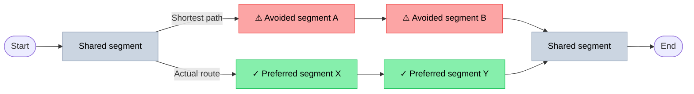

# Detour Analysis & Ride Intent Classification

## What This Does

After a ride is map-matched to the road network, the detour analyzer computes the shortest path between the ride's start and end points and compares it to the actual route. T
his produces two types of events per street segment:

- **Avoidance** — segment was on the shortest path but the cyclist went around it
- **Preference** — segment was *not* on the shortest path but the cyclist chose it anyway

These signals accumulate into per-segment counters (`avoidance_count`, `preference_count`, `usage_count`) and derived ratios used to rank problematic infrastructure.

The diagram below shows how a single ride produces both avoidance and preference events. Both paths share the start and end segments (grey). The shortest path passes through the red segments — because the rider bypassed them, they accumulate **avoidance** events. The actual route passes through the green segments — because the rider chose them despite not being on the shortest path, they accumulate **preference** events.



## Analysis Steps

### 1. Shortest Path Computation

GraphHopper computes the shortest path (by distance) between the first and last GPS points of the ride. Both the actual traversed edge IDs and the shortest path edge IDs are stored per ride.

### 2. Detour Detection

A ride is a detour if:

```
actual_distance > shortest_path_distance × (1 + threshold)
```

The threshold defaults to **10%** (`analysis.detour.threshold=0.10`). Rides within 10% of the shortest path are considered non-detours and generate no avoidance or preference events.

### 3. Alternative Route Filtering

Not every detour means the cyclist avoided specific segments — sometimes they took a completely different path (different neighborhood, different corridor). These are classified as **ALTERNATIVE_ROUTE** and skipped from event generation.

Detection: if fewer than 30% of the shortest path edges spatially overlap with the actual route, it's an alternative route, not a local detour.

### 4. Spatial Edge Filtering

GraphHopper sometimes assigns different edge IDs to physically adjacent paths (e.g., a segregated cycle path runs parallel to the road it serves). To avoid false avoidances, edges that are within **20 meters** (`analysis.spatial.proximity-meters`) of the actual trajectory are excluded from the avoided set — even if they're different edge IDs.

This uses a PostGIS `ST_DWithin` query in meters.

### 5. Event Registration

For detour rides, two sets of events are created:

- **Avoidance events** — shortest path edges that were spatially distant from the actual ride. Bearings come from the shortest path geometry.
- **Preference events** — actual ride edges that were spatially distant from the shortest path. Bearings come from map-matching output.

Each event stores the edge ID, bearing (compass direction), and an estimated timestamp (the moment the rider was closest to that edge).

For **non-detour rides**, only the usage count is incremented — no avoidance or preference events are generated.

## Ride Intent Classification

Each analyzed ride is classified as **COMMUTE**, **LEISURE**, or **UNKNOWN** based on a scoring model. This classification is attached to every segment event so that analyses can be filtered or broken down by intent.

### Scoring Model

A score is computed from multiple signals. If `score ≥ 2` → COMMUTE; if `score ≤ -2` → LEISURE; otherwise UNKNOWN.

**Time signals** (evaluated in Berlin timezone):

| Signal | Score |
|---|---|
| Weekend | −2 |
| Weekday, morning peak (06:00–09:00) | +2 |
| Weekday, evening peak (17:00–19:30) | +2 |
| Other weekday time | +1 |
| Duration 15–50 min | +1 |
| Duration > 50 min | −1 |
| Speed 12–22 km/h (urban commute pace) | +1 |
| Speed < 10 km/h | −1 |
| Speed > 28 km/h (sport pace) | −1 |

**Route signals:**

| Signal | Score |
|---|---|
| No detour (followed shortest path) | +1 |
| Is a detour | −1 |
| Status is ALTERNATIVE_ROUTE | −2 |
| Overlap ratio ≥ 85% | +1 |
| Actual/shortest distance ratio ≤ 1.15 | +1 |
| Actual/shortest distance ratio ≥ 1.50 | −2 |

**Equipment signals:**

| Signal | Score |
|---|---|
| Child transport seat | +1 |
| Trailer attached | −1 |
| Bike type: city/trekking/e-bike/freight | +1 |
| Bike type: road racing/mountain | −1 |

## Performance

Detour analysis runs one GraphHopper routing query and several database round trips per ride, across a batch of up to `pipeline.analysis.batch-size` rides on `pipeline.analysis.thread-pool-size` parallel threads. Three things keep this fast at scale:

- **Contraction Hierarchy (CH) routing.** Finding the shortest route on a country-sized road network means searching outward through millions of intersections until the destination turns up - too slow to do for every ride. CH fixes this with one-time prep at startup: it ranks intersections by importance and adds direct shortcuts between the important ones, similar to how a road atlas highlights highways over side streets. At query time, GraphHopper mostly follows these shortcuts instead of the full street grid, so a route lookup drops from seconds to single-digit milliseconds. See the README's "Run the backend in Docker" section for the one-time prep cost.
- **Single-transaction analysis.** `DetourAnalysisService.analyzeRide` loads, mutates, and persists a `Ride` within one transaction, so the entity stays managed throughout and Hibernate flushes only the changed fields on commit. On any error the transaction rolls back and the ride is marked `ERROR` separately, so no partial analysis results are ever persisted.
- **Indexed per-ride lookups.** `ride_points.ride_id` and `ride_edges.ride_id` are indexed (see [data-model.md](data-model.md)), so loading a ride's GPS trace and traversed edges is an index lookup rather than a full table scan, independent of how many rides have accumulated in the database.

## Scheduler Configuration

| Property | Default | Description |
|---|---|---|
| `pipeline.analysis.enabled` | `true` | Enable/disable the scheduler |
| `pipeline.analysis.delay-ms` | `10000` | Polling interval (ms) |
| `pipeline.analysis.batch-size` | `500` | Rides claimed per batch |
| `pipeline.analysis.thread-pool-size` | `8` | Parallel GraphHopper workers |
| `analysis.detour.threshold` | `0.10` | Detour detection threshold (10%) |
| `analysis.spatial.proximity-meters` | `20` | Parallel path tolerance (meters) |
